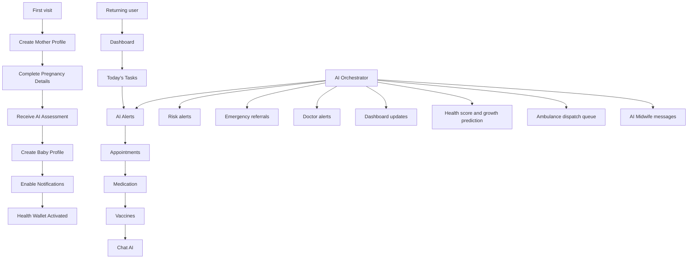

# MamaCare AI Product Architecture

## New folder structure

```text
app/
  config/
    productFlow.ts              # Navigation, workflow steps, section aliases
  hooks/
    useMamaCareAppState.ts      # Shared app state, chat, pregnancy/vaccine helpers
    usePersistentState.ts       # Centralized localStorage hook
    useCareWorkflow.ts          # First-visit + returning-user workflow state
    useNotifications.ts         # AI notification feed hook
  components/
    providers/
      MamaCareProvider.tsx      # Context: app + workflow + notifications
    layout/
      ModuleSection.tsx
      WorkflowStepper.tsx       # First-visit guided steps
      ReturningUserFlow.tsx     # Returning-user quick path chips
    modules/
      DashboardModule.tsx       # Home dashboard composer
      CareModules.tsx           # AI, Pregnancy, Mother, Baby, etc.
    cards/
      TaskCard.tsx
      AIAlertCard.tsx
      BlockchainStatusCard.tsx
    ai/
      AIAutomationFeed.tsx      # Orchestrator activity log
    ...existing feature components (names preserved)
  lib/
    storage/
      keys.ts                   # Canonical localStorage key constants
      storageService.ts         # readJSON, writeJSON, subscribeStorage
    ai/
      aiNotificationService.ts
      aiReferralService.ts
      aiDashboardService.ts
    AIOrchestrator.ts           # Composes all AI services
    AICoreEngine.ts
    botchain.ts
    blockchain.ts
    medicalRecordService.ts
```

## Navigation hierarchy

```text
Home Dashboard
  ├── AI Care Coordinator (automation feed)
  ├── Guided Workflow (first visit) / Today's Care Path (returning)
  ├── Today's Tasks
  ├── AI Alerts
  └── Quick Actions

AI Care → Pregnancy → Mother → Baby → Emergency → Health Wallet → Doctor → Government

Secondary deep links (preserved):
  /mother, /baby, /doctor, /hospital, /ambulance, /chw, /ai-midwife, /blockchain, /verify
```

## Workflow diagram



## Components to move (future passes)

- Pregnancy: `PregnancyTracker`, `PregnancyTimeline`, `AIMaternalRiskPrediction`
- Mother: `MotherProfile`, `AIHealthScore`, `AIHealthSummary`, `HealthAnalytics`
- Baby: `BabyProfile`, `BabyGrowthPrediction`, `VaccineTracker`, `GrowthTracker`
- Emergency: `EmergencySOS`, `NearbyHospitals`, `ReferralSystem`
- AI: `AICareCoordinator`, `ChatScreen`, `SymptomChecker`, `AIMidwife`
- Clinical: `DoctorMode`, `HealthWallet`, `BlockchainAuditExplorer`
- Government: `MinistryDashboard`, `PopulationAnalyticsDashboard`

## Components to merge (later)

- `NotificationCenter` (root) + `notifications/NotificationCenter` → single export
- `GrowthTracker` (root) + `baby/GrowthTracker` → shared wrapper
- `AICareCoordinator` (root) + `ai/AICareCoordinator` → keep root UI, retire import-time script

## Components to keep

All existing feature component names and exports are preserved. Module composers wrap them.

## Pages to simplify

| Page | Status |
|------|--------|
| `app/page.tsx` | Unified shell + module router via `MamaCareProvider` |
| `app/mother/page.tsx` | Deep link — reuse `MotherModule` in future pass |
| `app/baby/page.tsx` | Deep link — reuse `BabyModule` in future pass |
| `app/ai-midwife/page.tsx` | Deep link — `AIMidwife` preserved |
| `app/doctor/page.tsx` | Deep link — `DoctorMode` preserved |
| `app/hospital/page.tsx` | Deep link — hospital network preserved |
| `app/blockchain/page.tsx` | BOT Chain explorer preserved |
| `app/verify/page.tsx` | Doctor verification preserved |

## Reusable layouts

| Component | Purpose |
|-----------|---------|
| `AppShell` | Header, sidebar, mobile nav |
| `ModuleSection` | Consistent module headings |
| `WorkflowStepper` | First-visit onboarding steps |
| `ReturningUserFlow` | Returning-user navigation chips |

## Reusable cards

| Component | Purpose |
|-----------|---------|
| `TaskCard` | Today's tasks |
| `AIAlertCard` | Orchestrator notifications |
| `BlockchainStatusCard` | Wallet / BOT Chain status |
| `SectionCard` | Generic section wrapper (existing) |
| `VitalCard` | Vitals display (existing) |

## Reusable hooks

| Hook | Purpose |
|------|---------|
| `useMamaCareAppState` | Chat, sections, pregnancy/vaccine, AI refresh |
| `useMamaCare` | Provider context (app + workflow + notifications) |
| `usePersistentState` | Typed localStorage with cross-tab sync |
| `useCareWorkflow` | Onboarding progress detection |
| `useNotifications` | Notification list + mark read |

## Reusable state

Centralized via `lib/storage/storageService.ts`. Key names unchanged for backward compatibility.

## Reusable AI services

| Service | Triggers |
|---------|----------|
| `AIOrchestrator` | Composes all automation on each run |
| `aiNotificationService` | Push alerts and recommendations |
| `aiReferralService` | Emergency mode, hospital referrals, ambulance queue |
| `aiDashboardService` | Health score, growth prediction, doctor alerts, dashboard snapshot |
| `AICoreEngine` | Risk scoring engine |

## BOT Chain integration (preserved)

- Health Wallet (`HealthWallet.tsx`)
- Audit Explorer (`BlockchainAuditExplorer.tsx`, `/blockchain`)
- Doctor verification (`/verify`, `medicalRecordService.ts`)
- Hospital referrals (`hospitalReferrals` key, hospital module)
- Emergency dispatch (`dispatchQueue`, `/ambulance`)
- Government analytics (`GovernmentModule`, ministry dashboards)
